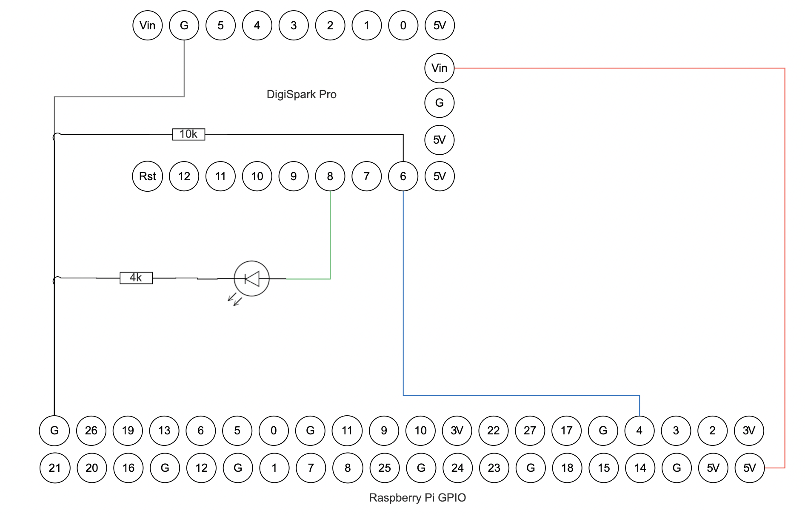

# Raspberry Pi Activity Light Shim

Microcontroller shim that makes an external activity light more visible. When using a GPIO to drive the activity light on a Raspberry Pi instead of the on-board LED, a lot of the activity is too brief for a standard LED to illuminate fully making it appear inactive. This project adds a microcontroller shim that ensures any SD card activity will result in the LED illuminating for long enough to be clearly visible. After some experimentation I found that a minimum time of 50ms was an ideal compromise between visibility and being able to maintain a nice flickery effect that looks like a drive activity indicator from a floppy or hard disk drive.

## Requirements

- Raspberry Pi
- Microcontroller (this example uses a DigiSpark Pro ATTiny167 board) and cable for flashing
- 4kΩ resistor - adjust as required for LED brightness
- 10kΩ resistor (not required if your board has built-in pull-down resistors e.g. ESP32 - but ensure the pin mode is set to INPUT_PULLDOWN and that you select an appropriate pin since not all pins have resistors built in)
- LED
- Wires (simple wires for soldering or DuPont connectors - for breadboard-based)
- Some soldering experience
- An installation of [PlatformIO](https://platformio.org) on VSCode or Atom

## Instructions

Connect the devices as below. Although the Pi GPIOs run on 3.3V I've found that it does not work unless the microcontroller is powered from 5V. This will vary between boards.



Flash the firmware from this project onto the board (making sure to correct if the pins are different).

In this example, Pin 7 is added as a 'test' pin to check functionality without a Pi. Simply cross connect pins 7 and 6 to simulate the Pi activity indicator going high.

Add the following line to /boot/config.txt (or amend with the additional parameters if dtoverlay is already enabled).

Pi 3:
```
dtoverlay=pi3-act-led,gpio=4
```

Pi 4:
```
dtoverlay=act-led,gpio=4
```

Again, change as appropriate if you want to connect a different GPIO.